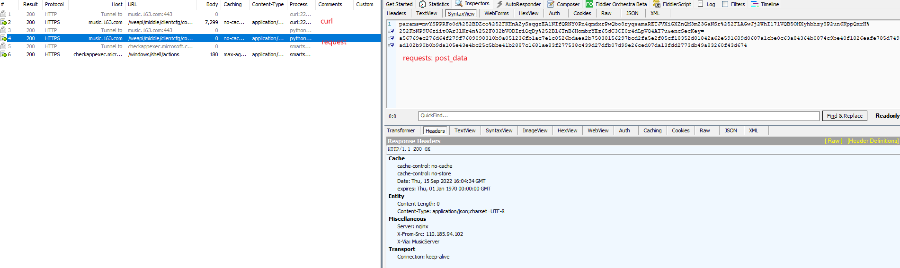

# requests模块二次编码导致的请求异常分析

## 场景描述
在一次web端的API分析过程中，在分析一个数据接口时，发现对于curl命令和其等价的python requests请求，
产生了不一致的response。
```
# curl -> 
"""
curl 'https://music.163.com/weapi/middle/clientcfg/config/list?csrf_token=' \
  -H 'authority: music.163.com' \
  -H 'accept: */*' \
  -H 'accept-language: zh-CN,zh;q=0.9' \
  -H 'content-type: application/x-www-form-urlencoded' \
  -H 'cookie: WNMCID=hlgusj.1644759482271.01.0; WEVNSM=1.0.0; NMTID=00OBSN_WyfQmFxackvJguBWDNsu1gUAAAF-804A_w; WM_TID=4budwMXm409FBVQQQVZq%2BLofYfgFCmf3; _ntes_nnid=d31642e9dcbb099fbc815d926fbfe7bb,1660056866048; _ntes_nuid=d31642e9dcbb099fbc815d926fbfe7bb; _iuqxldmzr_=32; JSESSIONID-WYYY=2nZviTJAnaQUrOkSgeUPKK0cjP7cXtRwn5cel4c9t%2BO%5CMncSnGyiAproqKzczb7p27t%2BTe0AjjJ%2FpVt7u1PTDHQiqoKg8PEliS0lKRyCJJw4FRrXNUVldVb2irdf8oSm7sogWROQYJzUs%2FX33kKAFxINom%2Frd1wbKxxwGyA4K%2Bt8IhYK%3A1663254094494; WM_NI=CtHJVI3pH6WIhLGZk%2Bnc5%2Bb6249qD%2B4sylbaJygS7AADxqfX9YbdoR4ZITbgRGAZ8yfx3r6UIQ%2F5%2Bu72%2FD6bQIlfsG%2FM3W6si0ZmUmkGeDh4kNjaMnHfmELU397KySvOODY%3D; WM_NIKE=9ca17ae2e6ffcda170e2e6eeb6e8549c868e87ec80ab8e8eb6c44a868e9a87c450ba9f8888d33eb3888f92cb2af0fea7c3b92a81ac88abd543f1b088d7d643ac9489bbea21aebdfbcce13ef2ecf792c721f8adb78de16b8aa7a9b4b64b839cb892e554fb87ae85ee5af88687b5e16d92998fbbbb73a6a8fd93b55f8b8fe1d6aa7ff5eee1a5b56a9397a487f24ded93fdb8b579abf0968ed867a999aba5eb40a992a682d0668cbaa3a6cf5ff1e7f9acfc59b69181a5dc37e2a3' \
  -H 'origin: https://music.163.com' \
  -H 'referer: https://music.163.com/song?id=1925052534' \
  -H 'sec-ch-ua: "Google Chrome";v="105", "Not)A;Brand";v="8", "Chromium";v="105"' \
  -H 'sec-ch-ua-mobile: ?0' \
  -H 'sec-ch-ua-platform: "Windows"' \
  -H 'sec-fetch-dest: empty' \
  -H 'sec-fetch-mode: cors' \
  -H 'sec-fetch-site: same-origin' \
  -H 'user-agent: Mozilla/5.0 (Windows NT 10.0; Win64; x64) AppleWebKit/537.36 (KHTML, like Gecko) Chrome/105.0.0.0 Safari/537.36' \
  --data-raw 'params=mvYSPPRFo0d%2BDZco%2FKHnAZySsqgzEA1NIfQRNY0Pn4qmdxrPwQbo8ryqsamaRETJVXiGXZnQM3mZ3GaNSr%2FLAGwJj2WhI171VQB5OMXyhbhzy8P2un6KppQxrH%2FbNP9U6ziitOAr3lKr4n%2F832bVODIriQqDy%2Bl6TnB6HombrYEz65dC3CI0r4dLpVQ4AT7u&encSecKey=a56769ec276d64f279f7609098310b9a051236fb1ac7e1c8526bdaea2b75838156297bcd2fa5e2f85cf18352d81842a62e591689d0607a1cbe0c63a84364b0874c9be40f1826eafe785d749ad102b90b0b9da105e43e4bc25c5bbe41b2887c1681ae83f277538c439d27dfb07d99e26ced07da13fdd2773db49a83260f43d674' \
  --compressed
""" 

# 等价的 python requests 请求 -> 
res = requests.post(
    url = "https://music.163.com/weapi/middle/clientcfg/config/list",
    headers = {
        'authority': 'music.163.com',
        'accept': '*/*',
        'accept-language': 'zh-CN,zh;q=0.9',
        'content-type': 'application/x-www-form-urlencoded',
        'origin': 'https://music.163.com',
        'referer': 'https://music.163.com/song?id=1925052534',
        'sec-ch-ua': '"Google Chrome";v="105", "Not)A;Brand";v="8", "Chromium";v="105"',
        'sec-ch-ua-mobile': '?0',
        'sec-ch-ua-platform': '"Windows"',
        'sec-fetch-dest': 'empty',
        'sec-fetch-mode': 'cors',
        'sec-fetch-site': 'same-origin',
        'user-agent': 'Mozilla/5.0 (Windows NT 10.0; Win64; x64) AppleWebKit/537.36 (KHTML, like Gecko) Chrome/105.0.0.0 Safari/537.36',
    },
    cookies = {
        'WNMCID': 'hlgusj.1644759482271.01.0',
        'WEVNSM': '1.0.0',
        'NMTID': '00OBSN_WyfQmFxackvJguBWDNsu1gUAAAF-804A_w',
        'WM_TID': '4budwMXm409FBVQQQVZq%2BLofYfgFCmf3',
        '_ntes_nnid': 'd31642e9dcbb099fbc815d926fbfe7bb,1660056866048',
        '_ntes_nuid': 'd31642e9dcbb099fbc815d926fbfe7bb',
        '_iuqxldmzr_': '32',
        'JSESSIONID-WYYY': '2nZviTJAnaQUrOkSgeUPKK0cjP7cXtRwn5cel4c9t%2BO%5CMncSnGyiAproqKzczb7p27t%2BTe0AjjJ%2FpVt7u1PTDHQiqoKg8PEliS0lKRyCJJw4FRrXNUVldVb2irdf8oSm7sogWROQYJzUs%2FX33kKAFxINom%2Frd1wbKxxwGyA4K%2Bt8IhYK%3A1663254094494',
        'WM_NI': 'CtHJVI3pH6WIhLGZk%2Bnc5%2Bb6249qD%2B4sylbaJygS7AADxqfX9YbdoR4ZITbgRGAZ8yfx3r6UIQ%2F5%2Bu72%2FD6bQIlfsG%2FM3W6si0ZmUmkGeDh4kNjaMnHfmELU397KySvOODY%3D',
        'WM_NIKE': '9ca17ae2e6ffcda170e2e6eeb6e8549c868e87ec80ab8e8eb6c44a868e9a87c450ba9f8888d33eb3888f92cb2af0fea7c3b92a81ac88abd543f1b088d7d643ac9489bbea21aebdfbcce13ef2ecf792c721f8adb78de16b8aa7a9b4b64b839cb892e554fb87ae85ee5af88687b5e16d92998fbbbb73a6a8fd93b55f8b8fe1d6aa7ff5eee1a5b56a9397a487f24ded93fdb8b579abf0968ed867a999aba5eb40a992a682d0668cbaa3a6cf5ff1e7f9acfc59b69181a5dc37e2a3',
    },
    params = {
        'csrf_token': '',
    },
    data = {
        'params': 'mvYSPPRFo0d%2BDZco%2FKHnAZySsqgzEA1NIfQRNY0Pn4qmdxrPwQbo8ryqsamaRETJVXiGXZnQM3mZ3GaNSr%2FLAGwJj2WhI171VQB5OMXyhbhzy8P2un6KppQxrH%2FbNP9U6ziitOAr3lKr4n%2F832bVODIriQqDy%2Bl6TnB6HombrYEz65dC3CI0r4dLpVQ4AT7u',
        'encSecKey': 'a56769ec276d64f279f7609098310b9a051236fb1ac7e1c8526bdaea2b75838156297bcd2fa5e2f85cf18352d81842a62e591689d0607a1cbe0c63a84364b0874c9be40f1826eafe785d749ad102b90b0b9da105e43e4bc25c5bbe41b2887c1681ae83f277538c439d27dfb07d99e26ced07da13fdd2773db49a83260f43d674',
    },
)
```

--------------------------------------------------
## 问题分析
1. 对两次请求进行抓包，分析其差异性

2. 通过观察两个请求的 post_data 发现差异所在
```
# curl -> 
params=mvYSPPRFo0d%2BDZco%2FKHnAZySsqgzEA1NIfQRNY0Pn4qmdxrPwQbo8ryqsamaRETJVXiGXZnQM3mZ3GaNSr%2FLAGwJj2WhI171VQB5OMXyhbhzy8P2un6KppQxrH%2FbNP9U6ziitOAr3lKr4n%2F832bVODIriQqDy%2Bl6TnB6HombrYEz65dC3CI0r4dLpVQ4AT7u&encSecKey=a56769ec276d64f279f7609098310b9a051236fb1ac7e1c8526bdaea2b75838156297bcd2fa5e2f85cf18352d81842a62e591689d0607a1cbe0c63a84364b0874c9be40f1826eafe785d749ad102b90b0b9da105e43e4bc25c5bbe41b2887c1681ae83f277538c439d27dfb07d99e26ced07da13fdd2773db49a83260f43d674

# requests -> 
params=mvYSPPRFo0d%252BDZco%252FKHnAZySsqgzEA1NIfQRNY0Pn4qmdxrPwQbo8ryqsamaRETJVXiGXZnQM3mZ3GaNSr%252FLAGwJj2WhI171VQB5OMXyhbhzy8P2un6KppQxrH%252FbNP9U6ziitOAr3lKr4n%252F832bVODIriQqDy%252Bl6TnB6HombrYEz65dC3CI0r4dLpVQ4AT7u&encSecKey=a56769ec276d64f279f7609098310b9a051236fb1ac7e1c8526bdaea2b75838156297bcd2fa5e2f85cf18352d81842a62e591689d0607a1cbe0c63a84364b0874c9be40f1826eafe785d749ad102b90b0b9da105e43e4bc25c5bbe41b2887c1681ae83f277538c439d27dfb07d99e26ced07da13fdd2773db49a83260f43d674

# diff ->
mvYSPPRFo0d%2BDZco%2FKHnAZySsqgzEA1NIfQRNY0Pn4qmdxrPwQbo8ryqsamaRETJVXiGXZnQM3mZ3GaNSr%2FLAGwJj2WhI171VQB5OMXyhbhzy8P2un6KppQxrH%2FbNP9U6ziitOAr3lKr4n%2F832bVODIriQqDy%2Bl6TnB6HombrYEz65dC3CI0r4dLpVQ4AT7u

mvYSPPRFo0d%252BDZco%252FKHnAZySsqgzEA1NIfQRNY0Pn4qmdxrPwQbo8ryqsamaRETJVXiGXZnQM3mZ3GaNSr%252FLAGwJj2WhI171VQB5OMXyhbhzy8P2un6KppQxrH%252FbNP9U6ziitOAr3lKr4n%252F832bVODIriQqDy%252Bl6TnB6HombrYEz65dC3CI0r4dLpVQ4AT7u

mvYSPPRFo0d%252BDZco%252FKHnAZySsqgzEA1NIfQRNY0Pn4qmdxrPwQbo8ryqsamaRETJVXiGXZnQM3mZ3GaNSr%252FLAGwJj2WhI171VQB5OMXyhbhzy8P2un6KppQxrH%252FbNP9U6ziitOAr3lKr4n%252F832bVODIriQqDy%252Bl6TnB6HombrYEz65dC3CI0r4dLpVQ4AT7u
```
可以观察到 requests 的参数是对 curl 参数进行了 URLencode。

3. 由上述可知请求异常的原因是由于 requests 对 post_data 参数进行自动*URLencode*导致的，由于原始post_data已经进行了URLencode因此导致了二次编码。

--------------------------------------------------
### 源码分析
requests库对 post 请求的 data 参数进行处理的关键代码如下
```
def prepare_body(self, data, files, json=None):
    """Prepares the given HTTP body data."""

    # Check if file, fo, generator, iterator.
    # If not, run through normal process.

    # Nottin' on you.
    body = None
    content_type = None

    if not data and json is not None:
        # urllib3 requires a bytes-like body. Python 2's json.dumps
        # provides this natively, but Python 3 gives a Unicode string.
        content_type = 'application/json'

        try:
            body = complexjson.dumps(json, allow_nan=False)
        except ValueError as ve:
            raise InvalidJSONError(ve, request=self)

        if not isinstance(body, bytes):
            body = body.encode('utf-8')

    is_stream = all([
        hasattr(data, '__iter__'),
        not isinstance(data, (basestring, list, tuple, Mapping))
    ])

    if is_stream:
        try:
            length = super_len(data)
        except (TypeError, AttributeError, UnsupportedOperation):
            length = None

        body = data

        if getattr(body, 'tell', None) is not None:
            # Record the current file position before reading.
            # This will allow us to rewind a file in the event
            # of a redirect.
            try:
                self._body_position = body.tell()
            except (IOError, OSError):
                # This differentiates from None, allowing us to catch
                # a failed `tell()` later when trying to rewind the body
                self._body_position = object()

        if files:
            raise NotImplementedError('Streamed bodies and files are mutually exclusive.')

        if length:
            self.headers['Content-Length'] = builtin_str(length)
        else:
            self.headers['Transfer-Encoding'] = 'chunked'
    else:
        # Multi-part file uploads.
        if files:
            (body, content_type) = self._encode_files(files, data)
        else:
            if data:
                body = self._encode_params(data)
                if isinstance(data, basestring) or hasattr(data, 'read'):
                    content_type = None
                else:
                    content_type = 'application/x-www-form-urlencoded'

        self.prepare_content_length(body)

        # Add content-type if it wasn't explicitly provided.
        if content_type and ('content-type' not in self.headers):
            self.headers['Content-Type'] = content_type

    self.body = body
```
其中对于 data 参数进行处理的具体逻辑位于
```
if data:
    body = self._encode_params(data)
    if isinstance(data, basestring) or hasattr(data, 'read'):
        content_type = None
    else:
        content_type = 'application/x-www-form-urlencoded'


@staticmethod
def _encode_params(data):
    """Encode parameters in a piece of data.

    Will successfully encode parameters when passed as a dict or a list of
    2-tuples. Order is retained if data is a list of 2-tuples but arbitrary
    if parameters are supplied as a dict.
    """

    if isinstance(data, (str, bytes)):
        return data
    elif hasattr(data, 'read'):
        return data
    elif hasattr(data, '__iter__'):
        result = []
        for k, vs in to_key_val_list(data):
            if isinstance(vs, basestring) or not hasattr(vs, '__iter__'):
                vs = [vs]
            for v in vs:
                if v is not None:
                    result.append(
                        (k.encode('utf-8') if isinstance(k, str) else k,
                            v.encode('utf-8') if isinstance(v, str) else v))
        return urlencode(result, doseq=True)
    else:
        return data
```
通过观察上述源码可以发现，当 data 为一个可迭代对象时，会将其转换成 [(k, v)] 形式，并
对其进行 urlencode 处理。

--------------------------------------------------
## 解决方案
通过对源码分析可以发现，当 data 为str字符串或者bytes类型时，代码不会进行编码处理。因此可以通过
将data转换成字符串解决二次urlencode导致的异常。
```
# data = {
#     'params': 'mvYSPPRFo0d%2BDZco%2FKHnAZySsqgzEA1NIfQRNY0Pn4qmdxrPwQbo8ryqsamaRETJVXiGXZnQM3mZ3GaNSr%2FLAGwJj2WhI171VQB5OMXyhbhzy8P2un6KppQxrH%2FbNP9U6ziitOAr3lKr4n%2F832bVODIriQqDy%2Bl6TnB6HombrYEz65dC3CI0r4dLpVQ4AT7u',
#     'encSecKey': 'a56769ec276d64f279f7609098310b9a051236fb1ac7e1c8526bdaea2b75838156297bcd2fa5e2f85cf18352d81842a62e591689d0607a1cbe0c63a84364b0874c9be40f1826eafe785d749ad102b90b0b9da105e43e4bc25c5bbe41b2887c1681ae83f277538c439d27dfb07d99e26ced07da13fdd2773db49a83260f43d674',
# },
data = 'params=mvYSPPRFo0d%2BDZco%2FKHnAZySsqgzEA1NIfQRNY0Pn4qmdxrPwQbo8ryqsamaRETJVXiGXZnQM3mZ3GaNSr%2FLAGwJj2WhI171VQB5OMXyhbhzy8P2un6KppQxrH%2FbNP9U6ziitOAr3lKr4n%2F832bVODIriQqDy%2Bl6TnB6HombrYEz65dC3CI0r4dLpVQ4AT7u&encSecKey=a56769ec276d64f279f7609098310b9a051236fb1ac7e1c8526bdaea2b75838156297bcd2fa5e2f85cf18352d81842a62e591689d0607a1cbe0c63a84364b0874c9be40f1826eafe785d749ad102b90b0b9da105e43e4bc25c5bbe41b2887c1681ae83f277538c439d27dfb07d99e26ced07da13fdd2773db49a83260f43d674',
```


